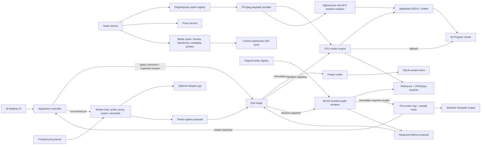

<!-- SPDX-License-Identifier: MPL-2.0 -->

# Architecture overview

The editor separates authoritative editorial state from media decoding, rendering, presentation,
and rebuildable artifacts. Typed edit commands produce immutable revisions; preview, persistence,
and export consume those revisions without allowing FFmpeg, Qt, SQLite, or GPU types into the edit
model.

The first public beta is Linux exclusive. Windows MSI signing and the Windows GPU/codec matrix are
deferred; the architecture still compiles the Windows D3D11 GPU backend for source-build preview.

The diagram describes the engine contracts and current desktop wiring. The engine decodes active
video clips and the desktop requests supported transforms directly on a libplacebo GPU before its
CPU renderer. The offscreen result is downloaded for the Qt viewer. Unsupported timeline content
including titles, transitions, and active effects falls back to the CPU reference graph for that
frame; backend/device failures preserve a CPU result and latch CPU-only preview for the session.
The CPU graph evaluates typed clip-local Hold/Linear/Bezier curves and known color/crop/blur
effects. The desktop does not yet supply a native presentation surface, zero-copy decode import, or
GPU effect parity. Forward 1× and J/K/L shuttle (0.5×, 2×, 4×, 8×, including reverse) connect the
timeline audio renderer to the realtime pre-render ring and selected miniaudio output; a
rate-scaled latency-compensated sample position drives video requests. Unavailable/failed devices
and unsupported shuttle rates use an explicit silent timer fallback. The worker host can
execute probe, proxy, export, and typed transcription requests. The desktop launches a fresh framed
worker process for each proxy, export, and transcription job. Kill is the cancellation and crash
boundary. The generic named-pipe or Unix-socket job service is not connected.

## Module boundaries

| Module | Owns | Must not be mistaken for |
| --- | --- | --- |
| `edit_model` | Exact `Time`, project entities including canonical titles/transitions and track state, validation, typed commands, atomic command batches, revisions, immutable snapshots, undo/redo, derived gaps, snapping | A renderer, database, or UI toolkit |
| `project_codec` | Deterministic schema-v3 Protobuf serialization plus backward schema-v1/v2 readers | The `.veproj` container or command history |
| `project_store` | SQLite schema-v2 journal payload versions, forward migration/backups, WAL working database, checkpoint save, integrity checks, recovery catalog | Media storage or timeline semantics |
| `media_codec` | Narrow FFmpeg runtime/version checks and media probing | Timeline ownership |
| `asset_service` | File fingerprints, import/relink validation, proxy recommendation policy | A persistent media-bin database |
| `proxy_service` | Cancellable proxy transcode, profile fallback, versioned PTS sidecar, atomic output | Authoritative media or a cache eviction service |
| `media_cache` | Content-addressed rebuildable-artifact store (thumbs, waveforms, metadata, proxies, PTS maps; LRU budget; `put_file`) | Authoritative media or the edit model |
| `playback` | Original/proxy registry, persistent FFmpeg decode sessions, keyframe seek, epoch cancellation, CPU color conversion | Audio-device playback or full color management |
| `render_engine` | Pull-based deterministic CPU frame graph including title/transition rendering, typed effect/keyframe evaluation, known color/crop/blur processing, and cache; capability-gated libplacebo D3D11/Vulkan transform/composite path with titles, transitions, five blend modes, moved-pivot rotation, and known clip effects, plus typed per-frame CPU fallback for unknown effects; Linux program-viewer swapchain presentation when a surface is supplied | Native GPU title/transition/effect shaders, full color/LUT parity, hardware decoder, or zero-copy bridge |
| `export_service` | Revision-bound originals-only FFV1/ProRes masters and FOSS VP9/Opus WebM creator delivery, exact frame/sample spans, scale/frame-rate controls, caption burn-in/sidecars, optional QSV/VAAPI VP9 with complete libvpx retry, and atomic media commit | H.264/AAC approval, embedded subtitle streams, or render queue |
| `audio_engine` | Planar float blocks, SPSC rings, DSP, callback-safe peak/RMS, worker-owned realtime/offline libebur128, fixed-format pre-render/sample clock, device enumeration/stable IDs, optional miniaudio adapter, and per-device QSettings latency calibration | Timeline decode, revision ownership, native OS hot-plug events, or a 10 ms physical A/V lab |
| `audio_render` | Originals-only FFmpeg decode/resample, deterministic immutable-snapshot mixing, track gain/pan, ordered stateful EQ/compressor/dialogue-denoise/limiter, and sample-range/stable-ID track meters in exact 48 kHz stereo blocks | An audio-device callback, arbitrary buses, or muxer |
| `caption_service` | SRT/WebVTT parse/serialize, timed-word reflow/search, deterministic caption and timeline-cut proposal planning | Speech recognition or caption rendering |
| `transcription_service` | Pinned model manifest/verification, exact FFmpeg source-window seek and mono 16 kHz trim, optional whisper.cpp backend, typed errors and validated source-absolute word results | Model download UI, project mutation, or a cloud service |
| `job_service` | Versioned Protobuf messages, framing, job IDs, and cancellation registry | Process spawning or a durable job scheduler |
| `workers` | Framed worker executable with fail-closed probe, proxy, export, and typed transcription jobs plus versioned events | A durable multiprocess scheduler or network service |
| `desktop_ui` | Qt Widgets shell, docks, workspaces, virtualized multi-selection timeline surface, professional tool/header interaction, panels, accessibility labels | Editorial truth or an independent snap algorithm |
| `app` | Cross-module orchestration, transient selection, exact UI/model time conversion, current project lifecycle, async import/preview/proxy/export, view models | A reusable core contract |

## Dependency direction

The key rule is inward dependency toward the edit model:

- `edit_model` has no Qt, FFmpeg, SQLite, Protobuf, or GPU dependency.
- `caption_service`, `project_codec`, and `render_engine` depend on edit-model contracts.
- `playback` implements the renderer's narrow frame-provider interface and hides FFmpeg types.
- `audio_render` depends on edit/audio contracts and an originals-only provider; it performs I/O on
  decode/export threads and must never run in an audio-device callback.
- `audio_engine` owns the realtime callback boundary. Its provider may decode and allocate only on
  the pre-render worker; the callback consumes a bounded SPSC ring, zero-fills underruns, and updates
  atomics. The application provider owns an immutable timeline snapshot and translates exact sample
  ranges into `audio_render` requests.
- `render_engine` owns both the CPU oracle and GPU capability boundary. Its per-clip GPU path fails
  closed on unsupported timeline features; the controller selects it before CPU, while a device or
  render error never changes the edit revision and retains the CPU result as fallback.
- `project_store` stores opaque command/snapshot payloads and does not interpret edit semantics.
- `desktop_ui` emits presentation-oriented signals; `app` converts them into typed edit commands.
  The controller also supplies a synchronous presentation-level resolver backed by the edit-model
  snapping query, so the widget never duplicates marker/frame/edge tie semantics.
- `app` is the composition root and may depend on the desktop and engine modules.

Public-contract changes require an ADR and the repository's two-owner review. The source dependency
contract is recorded in `cmake/DependencyVersions.cmake`.

## Revision and preview flow

1. A UI gesture ends and the controller constructs one `EditCommand` or an atomic command batch
   with the editor's current expected revision. Selection changes themselves remain transient.
2. The edit model copies the project, applies and validates every requested operation, then
   publishes one next immutable revision and history entry. A stale revision or failed batch member
   returns an error without publishing partial state.
3. The controller serializes the resulting project snapshot and appends it to the SQLite journal.
   If persistence fails, it rolls back the model edit.
4. Views are rebuilt from the current immutable project. Preview requests use a monotonically newer
   epoch; stale decode work returns a cancellation-style error rather than updating the viewer.
5. Export captures one `TimelineSnapshot`, creates independent originals-only video and audio
   providers, disables proxies, renders exact frame/sample ranges, and remains isolated from later
   UI revisions. Reference masters use FFV1/ProRes plus PCM; creator presets use software VP9/Opus
   WebM with exact rational output sampling.

## Authoritative and rebuildable state

Authoritative state consists of the project entities, journal revisions, project metadata, media
references/fingerprints, title payloads, transitions, track name/order/lock/visibility/targeting,
effect parameters, timed captions/provenance/style, and schema versions. Clip/marker/gap selection
and derived gap keys are
presentation state, not project entities. Original media remains
authoritative for image/audio content but is referenced rather than embedded.

Proxies, PTS sidecars, thumbnails, waveforms, decoded frames, render results, GPU textures, and
checksummed transcription models are rebuildable and stay outside `.veproj`. The desktop owns one
`media_cache` `CacheStore` with a configurable LRU budget that also holds completed proxies and
`.vepts` maps. Media-bin thumbnails, timeline waveforms, Inspector metadata, Relink, proxy
rediscovery, and **File > Manage Media Cache…** are wired. Proxy and export generation run in a
fresh `video_editor_worker_host` process.

## Concurrency and cancellation

Import, preview, proxy generation, export, model verification, transcription, and silence analysis
run away from the Qt UI thread. Preview uses request
epochs. Proxy, export, and transcription use a fresh framed worker-host process; kill is the
cancellation and crash boundary, and only atomically committed files replace destinations. The
stdin/stdout host still dispatches one job synchronously, so it cannot consume a `CancelJob` frame
while FFmpeg is running. Named-pipe/Unix-socket routing is not connected. Cache jobs, import, and
preview remain in-process through QtConcurrent or request epochs.

The realtime audio path has a dedicated pre-render worker and a fixed 48 kHz stereo float32 device
boundary. Its callback performs ring reads, deterministic zero-fill, and atomic diagnostics only.
For forward 1× desktop playback, the latency-compensated playback position is the video master
clock; the submitted-buffer position and latency uncertainty remain diagnostics. Pause/resume/seek
operate on the same controller, while edits and project replacement destroy the old revision's
playback. `AsyncRealtimeAudioPlayback` supplies a serialized background control thread with versioned
requested/effective state; the desktop enqueues commands, waits for effective completion without
blocking Qt signals, and only then adopts audio as master. During a pending start or seek it holds the
video position rather than advancing from a conflicting timer. A stable selected-device ID is
passed to miniaudio when playback opens. When miniaudio is absent or a device/provider fails, the
controller reports the limitation and uses silent timer-driven video. Reverse and non-1× shuttle
rates of 0.5×, 2×, 4×, and 8× keep audio as master when the device is available. The desktop polls devices off the UI thread, pauses on selected/default loss, and retries a
returned endpoint only after serialized stop settles while playback remains intended. Native OS
notifications remain outside the current wiring. Per-device output latency may be calibrated into
QSettings; the 10 ms physical A/V gate is still a lab requirement.

## Further reading

- [Exact timeline semantics](../reference/timeline-semantics.md)
- [Project format and recovery](../reference/project-format-and-recovery.md)
- [Media, proxies, and cache](../reference/media-proxies-and-cache.md)
- [Beta feature status](../beta-feature-status.md)
- [Accepted ADRs](../index.md#architecture-decisions)
- [Schema v2 title and transition contracts](0013-schema-v2-titles-transitions.md)
- [Professional timeline interaction boundary](0014-professional-timeline-interaction.md)
- [Clip-local effect curves and CPU reference effects](0015-effect-parameter-authoring.md)
- [FOSS creator delivery with VP9 and Opus](0016-foss-creator-delivery.md)
- [Professional track audio, DSP, meters, and normalization](0017-professional-audio-workflow.md)
- [Local transcription, timed captions, and reviewable proposals](0018-local-transcription-and-caption-proposals.md)
